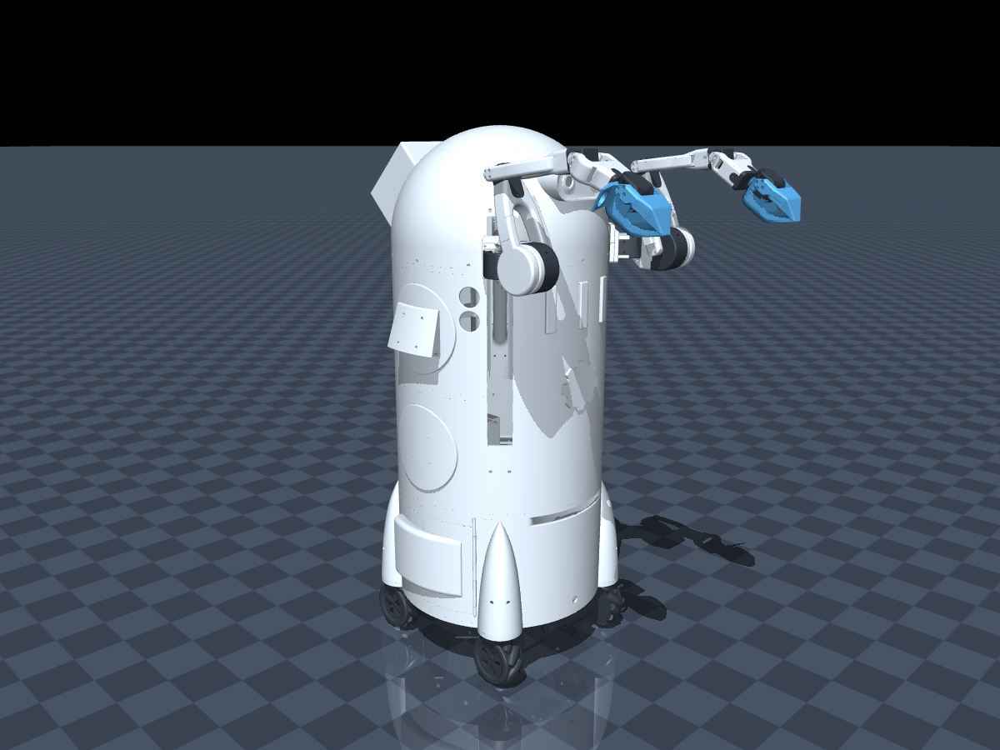
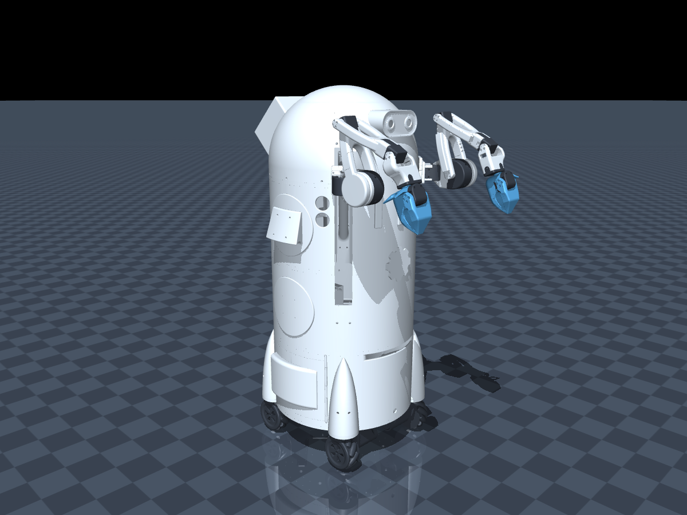

# Sourccey robot in MuJoCo

A runnable simulation of the full Sourccey assembly: both arms, wrists, grippers,
shoulder elevator, and four driven mecanum wheels.



## Run

On a fresh Windows checkout, install Python **3.12** and run these commands
from this folder:

```powershell
.\setup.cmd
.\run.cmd
```

`setup.cmd` creates a local `.venv`, installs the pinned dependencies, builds
the MuJoCo model, and runs the checks. The executable is not tracked in Git.
To make a one-click copy, run `package.cmd` after setup and close any running
`SourcceyMuJoCo.exe` before replacing it. The generated executable bundles
the MuJoCo runtime, robot model, and meshes.

This opens the native MuJoCo viewer and a separate control panel. Drag in the
viewer to orbit; scroll to zoom. The panel provides forward/strafe/yaw controls,
elevator travel, all twelve arm/wrist/gripper joints, and per-arm XYZ reach targets.
Release a base slider to stop. Escape or **STOP BASE** also stops the base.
Reset restores the raised-arm pose shown in your MuJoCo screenshot.

Joint sliders show **full-assembly URDF degrees**. The elevator slider uses meters.
Gripper -5° is closed, +60° is open. Reach targets use meters from
the moving shoulder mount: X forward, Y left, Z up. IK controls pan, lift, and
elbow; wrist flex and roll are independent. Changing a joint slider returns that
arm to joint control. Frozen reach targets follow the chassis and elevator.
Resume discards target-slider changes made while frozen.

The `.cmd` launchers also work with a restricted PowerShell script policy.
The optional `.ps1` equivalents are also included. To launch Python directly:

```powershell
.\.venv\Scripts\python.exe -m sourccey.app
```

Other commands:

```powershell
# Compile the copied URDF and regenerate MJCF.
.\.venv\Scripts\python.exe -m sourccey.build
# Run regression and physics checks.
.\.venv\Scripts\python.exe -m pytest -q
# Run five simulated seconds and save a render.
.\.venv\Scripts\python.exe -m sourccey.app --headless --seconds 5 --render artifacts/preview.png
# Generate measurements and inspection images.
.\.venv\Scripts\python.exe -m sourccey.validate
# Extend the elevator's lower endpoint to the full URDF limit.
.\run.cmd --full-elevator-range
```

`--no-panel` uses only MuJoCo's native UI. `--no-traction` disables the equivalent
mecanum friction forces: wheels spin but cannot drive the base.

## Model and provenance

The [source model](models/source/SourcceyURDF) contains the robot URDF and 171
STL assets, preserved in their original filenames and layout.

- [sourccey/build.py](sourccey/build.py): reproducible conversion; edit this to make lasting model changes.
- [models/sourccey.xml](models/sourccey.xml): generated working model.
- [models/build_info.json](models/build_info.json): inventory, mass, wheel centers, compiler version.

The original URDF compiles directly with all **17 movable joints**. The working
MJCF preserves 132 links, 171 visual meshes, source axes/inertias, and adds
one floating-base joint plus 17 actuators. Both arms remain descendants of the
elevator. STL millimeters are scaled to meters. A +45° Z rotation aligns CAD
forward with +X. Tests compare the generated joint frames to native URDF import
at random poses. Joint limits match the source except the two elbow lower stops,
which are widened for the requested downward bend.

## Controls and defaults

The base sliders accept normalized forward, strafe, and yaw commands from −1 to
+1. Their maximum translation speed is 0.6 m/s and maximum yaw speed is 90°/s.
Release a slider or press **STOP BASE** to brake the wheels.

The elevator uses meters. Its default control range is **−0.3104 m to −0.0142 m**;
`--full-elevator-range` extends the lower endpoint to **−0.315 m**. The upper
endpoint is also the physical joint stop and startup position. Startup and Reset
use the pose in [sourccey/pose.py](sourccey/pose.py): left/right shoulder lifts
**+2.01/−2.01 rad**, both elbows **−2.0 rad**, and wheels at rest. The MJCF
stores this pose as keyframe `startup` (key 0).

The panel and Python API command joint angles in radians (degrees in sliders).
See [control and physics notes](docs/CONTROL_AND_PHYSICS.md) for the API and model
details. No physical-robot transport is included.

## Validation and physical limits

The checks cover inventory, URDF/MJCF frames, all arm joint limits/midpoints, both elevator
ranges, wheel signs in both directions, forward/strafe/yaw and braking, airborne
and disabled traction, IK, unreachable targets, screenshot startup pose, gripper
clearance and invalid input. The desktop panel and
native viewer were smoke-tested; rendered poses were visually inspected.

[Recorded measurements](docs/validation.json), over two seconds at 50% command:

| Check | Result |
| --- | --- |
| Forward | 0.573 m forward |
| Left strafe | 0.570 m left; 7.0 mm cross-axis drift |
| CCW yaw | 87.90°; about 0.94 mm translation |
| Nearby IK target, left/right | 0.039 / 0.040 mm final error |
| Closed gripper pads | at least 1.059 mm separation, both arms |
| Drive-test simulation warnings | none |

These are software acceptance results, not measured hardware agreement:

- CAD mass totals **169.042 kg** and predates mesh filtering. Verify real masses,
  materials, and inertias before quantitative dynamics work.
- Wheels use **contact-based equivalent mecanum friction**, spherical contact
  proxies, and load-limited diagonal forces. Individual rollers are not modeled.
  Only flat stationary floors are supported; slopes, obstacles, roller impacts,
  and real tire slip are not validated.
- Chassis collision is a box; arm/environment collisions use per-part convex hulls.
  Robot self-collision is disabled because mating CAD parts overlap. This is not
  a collision-free planner or a validated grasping model.
- Position drives use idealized bias compensation inside finite force caps.
  Gains/force limits are simulation tuning, not measured motor ratings.
- Both source elbow joints stop at −90°. MuJoCo extends their lower limit to
  **−135°** so the forearms can bend downward farther; the joint and actuator
  slider ranges are widened together. This is a simulation override, not a
  verified physical stop. Change `ELBOW_LOWER_DEGREES` in
  [sourccey/build.py](sourccey/build.py) and rebuild if measurement calls for
  a different limit. The copied URDF remains unchanged.
- The source elevator reaches 0 m, while this simulation stops upward travel at
  **−0.0142 m**. Its actuator target range and both `z_vel` mappings share that
  cap; the default control lower end remains −0.3104 m.


- Opening the MJCF elsewhere preserves articulation and normal contact, but
  **traction and bias compensation require this Python simulation loop**.

References: official [MuJoCo Python API](https://mujoco.readthedocs.io/en/stable/python.html),
[URDF modeling guidance](https://mujoco.readthedocs.io/en/stable/modeling.html#urdf-extensions),
and [XML reference](https://mujoco.readthedocs.io/en/stable/XMLreference.html).
